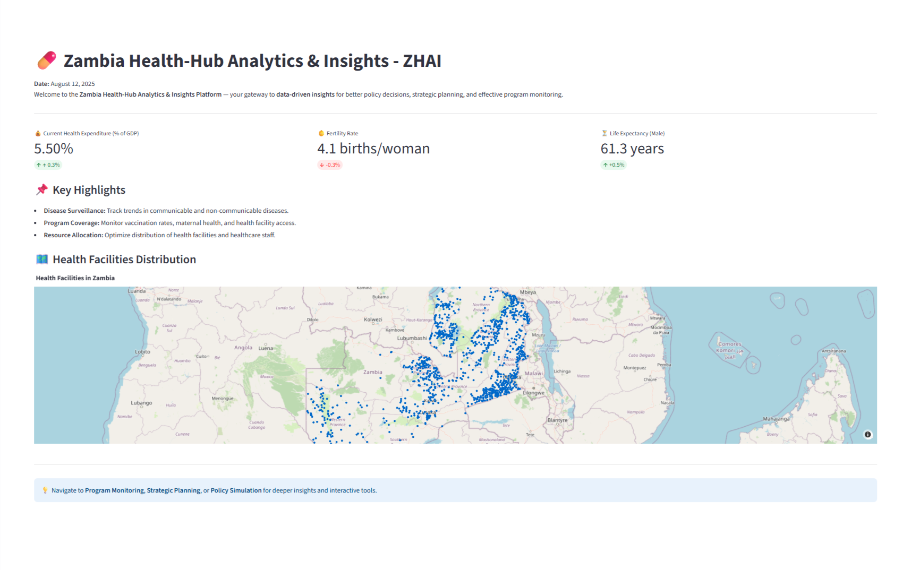
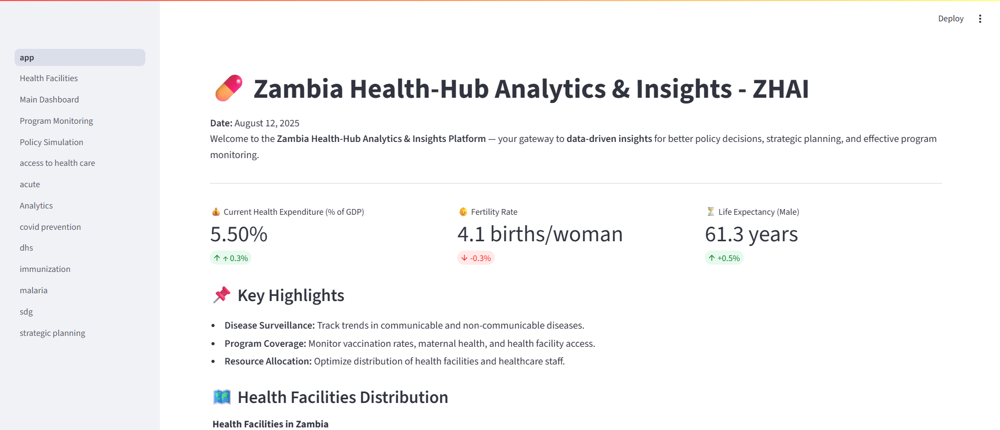
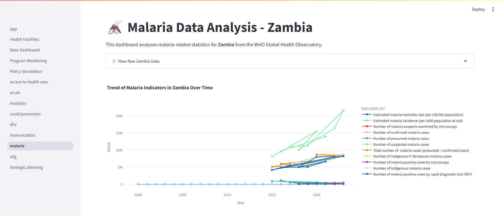
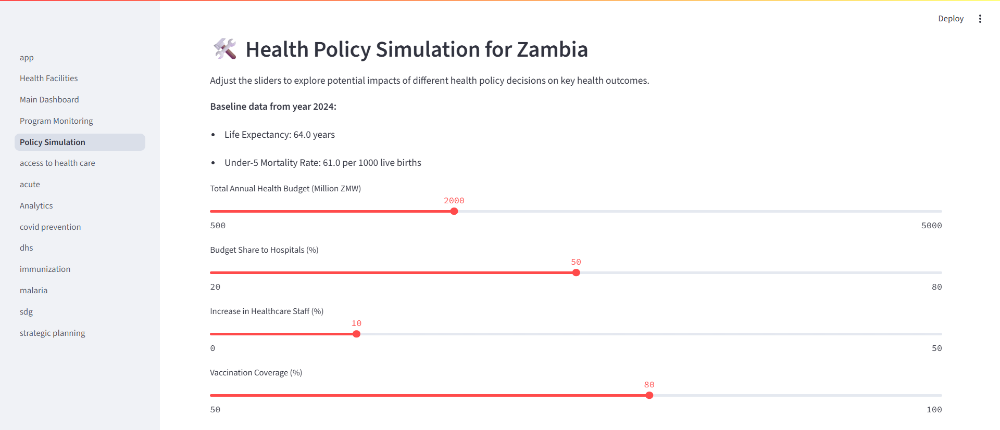

# Zambia HealthHub


**Zambia HealthHub** is an interactive public health analytics platform designed to support data-driven decision-making for health policy, strategic planning, and program monitoring in Zambia.

This platform integrates multiple health datasets to provide key performance indicators (KPIs), geospatial visualizations of health facilities, disease trends, and policy simulation tools. Zambia HealthHub aims to empower policymakers, researchers, and stakeholders with actionable insights to improve health outcomes.

---

## Features



- **KPI Dashboard:** View up-to-date health indicators such as health expenditure, fertility rate, life expectancy, and infant mortality trends.
- **Health Facilities Map:** Interactive map showing locations of health facilities across Zambia.

- **Trend Visualizations:** Line charts displaying historical trends of key health metrics.

- **Policy Simulation:** Scenario modeling tool to simulate impacts of health budget, staffing, vaccination, and disease intervention policies.
- **Modular Structure:** Clean separation of components for ease of maintenance and future enhancements.

---

## Getting Started

### Prerequisites

- Python 3.8 or higher
- `pip` package manager

### Installation

1. Clone this repository:

   ```bash
   git clone https://github.com/kshula/zambia-healthhub.git
   cd zambia-healthhub


2. Clone this repository:

    ```bash
    python -m venv venv
    source venv/bin/activate  # Windows: venv\Scripts\activate

3. Install dependencies:

    ```bash
    pip install -r requirements.txt

4. Running the Application

    ```bash
    streamlit run app.py 

### Project Structure

zambia-healthhub/
│
├── app.py                      # Main app entry point
├── requirements.txt            # Python dependencies
├── README.md                   # This documentation file
├── data/                       # CSV and GeoJSON datasets
│   ├── worldbank_health_indicators.csv
│   ├── zambia_health_facilities.geojson
│   └── ... other datasets ...
├── utils/
│   └── data_loader.py          # Data loading utilities with caching
├── components/
│   ├── summary.py              # Summary and KPI dashboard components
│   ├── indicators.py           # Indicator data processing and visuals
│   ├── simulation.py           # Policy simulation modules
│   ├── interventions.py        # Intervention insights and visuals
│   └── modeling_advice.py      # Modeling best practices and advice
├── pages/
│   ├── strategic_planning.py   # Strategic Planning page
│   ├── policy_simulation.py    # Policy Simulation page
│   └── health_facilities.py    # Health Facilities Map page
└── images/                     # Static images and logos

### Data Sources

World Bank Health Indicators

Zambia Ministry of Health datasets

Demographic and Health Surveys (DHS)

OpenStreetMap (OSM) health facilities GeoJSON data

### Future Enhancements

Automate data updates and integration

Implement user authentication and role-based access

Add advanced geospatial analysis (heatmaps, clustering)

Enable exportable reports and dashboards (PDF, Excel)

Integrate mobile health data collection and real-time updates

Add more disease-specific analytics (HIV, Malaria, TB) with predictive modeling

### Requirements

streamlit>=1.20.0
pandas>=1.3.0
numpy>=1.21.0
plotly>=5.5.0
geopandas>=0.12.0
shapely>=1.8.0
streamlit-folium>=0.10.0
folium>=0.13.0

### Contact

For questions, collaboration, or feedback, please contact

Kampamba Shula
Email: <kampambashula@gmail.com>
GitHub: kshula

Thank you for exploring Zambia HealthHub — advancing public health through data-driven insights!
